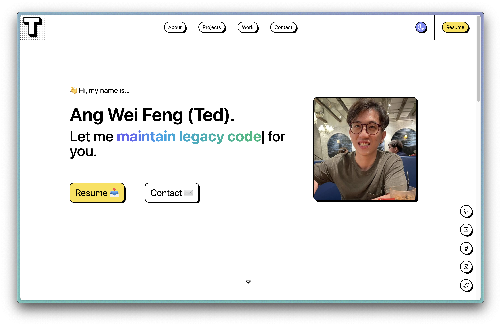
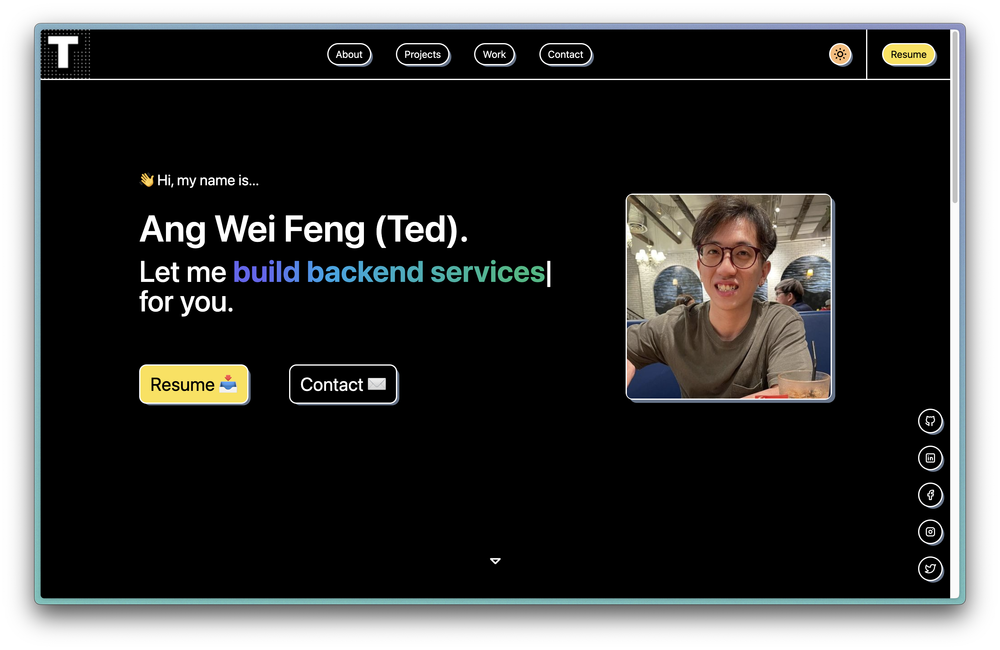
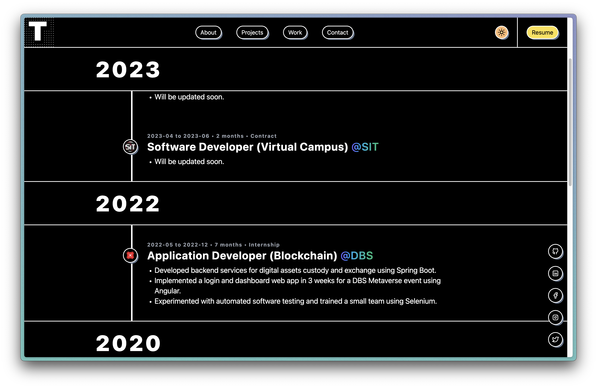

# Portfolio 2023 (Outdated)

[2024 UPDATE: I am currently building a new site.](https://github.com/tedawf/tedawf-site)

Simple portfolio made with the [Astro](https://astro.build/) 🚀 framework.

UI inspiration was _roughly_ drawn from [Gumroad](https://gumroad.com/). I think it's called brutalism?

## 📸 Screenshots

